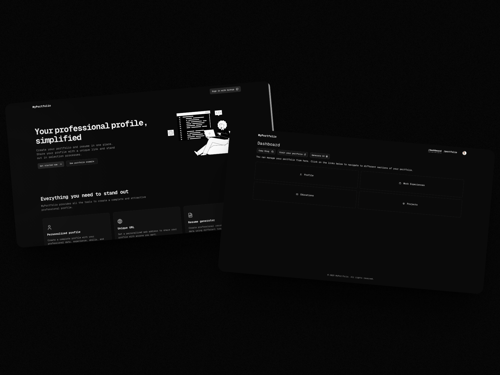
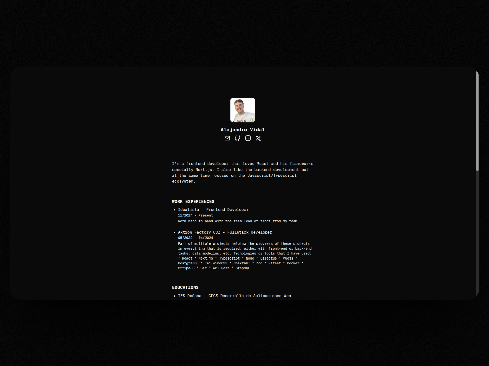
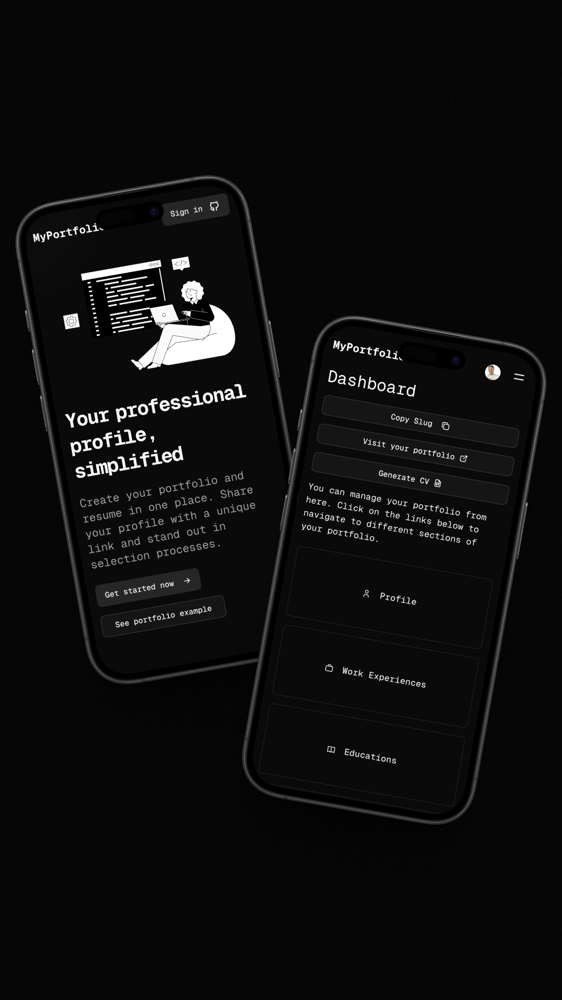
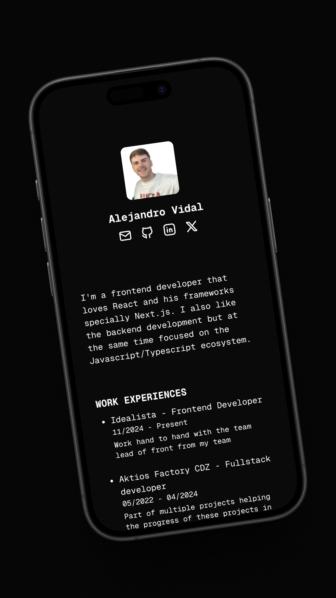

# MyPortfolio

[MyPortfolio](https://my-portfolio-five-kohl-50.vercel.app) es una aplicación web que permite a desarrolladores y profesionales del sector tecnológico crear su propio portfolio y currículum de forma rápida y sencilla, utilizando su cuenta de GitHub para registrarse.

## ✨ Descripción del proyecto

El objetivo de MyPortfolio es facilitar la creación de un portfolio profesional y un currículum personalizado, utilizando una interfaz sencilla y moderna. Una vez registrado con tu cuenta de GitHub, puedes acceder a un dashboard donde completar tu perfil con:

- Datos personales
- Proyectos destacados **(estos podrán ser importados desde GitHub)**
- Experiencias laborales
- Formación académica

A partir de esta información, la plataforma genera automáticamente:

- Una **URL pública** con tu portfolio que puedes compartir con quien quieras (ideal para procesos de selección).
- Un **currículum descargable en PDF** con el mismo contenido, diseñado de forma profesional.

## 🔗 Enlace a la demo

👉 [Ver demo en producción](https://my-portfolio-five-kohl-50.vercel.app)  

## 📸 Capturas de pantalla

|                        |                        |
| :--------------------: | :--------------------: |
|  |  |
|  |  |


## 🔐 Autenticación con Clerk

La autenticación y gestión de sesiones se ha implementado mediante [Clerk](https://clerk.dev/), lo que permite una integración rápida y segura con GitHub como proveedor OAuth.

### ¿Cómo se ha usado Clerk?

- **Inicio de sesión con Github**: Se ha utilizado el provider de GitHub de Clerk para permitir el inicio de sesión con GitHub. Esto ha permitido obtener un token de acceso a GitHub del usuario autenticado y así usarlo para importar proyectos si así lo desea desde GitHub.
- **SDK y componentes de Clerk**: Se han utilizado los componentes y el SDK de Clerk para facilitar el manejo y el control de la autenticación y la gestión de sesiones en la aplicación.
- **Proteger rutas**: Se ha utilizado el middleware de Clerk junto al de Next.js para proteger las rutas que no son accesibles a los usuarios no autenticados.

---

## 🛠️ Stack Tecnológico

- **Next.js** (App Router)
- **React** + **TypeScript**
- **Clerk** para autenticación
- **Tailwind CSS + Shadcn UI** para estilos
- **Vercel** para despliegue

## 🚀 Cómo ejecutarlo localmente

```bash
git clone https://github.com/alevidals/my-portfolio.git
cd myportfolio
pnpm install
pnpm dev